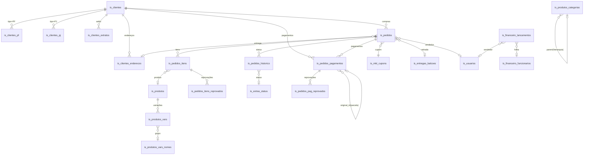

# Dicionário de Dados — NBL Gráfica (Supabase)

> **Versão**: 1.0 — Gerado em 2026-04-05
> **Banco**: `teste_grafica` (bcypejzqbcwibvtbbfor) — Supabase PostgreSQL 17
> **Total**: 33 tabelas base, 4 views, ~2 milhões de registros
>
> **Para LLMs**: Este documento é a referência canônica para geração de SQL.
> Também disponível no banco via: `SELECT * FROM vw_schema_llm_guide;`

---

## Visão Geral por Domínio

| Domínio | Tabelas | Registros | Descrição |
|---------|---------|-----------|-----------|
| **Clientes** | 5 | ~145k | Cadastro, endereços, dados PF/PJ, extrato de saldo |
| **Vendas/Pedidos** | 8 | ~909k | Pedidos, itens, pagamentos, histórico de status |
| **Produtos** | 5 | ~2.4k | Catálogo, categorias, variações |
| **Financeiro** | 2 | ~99k | Lançamentos (receitas/despesas), funcionários |
| **Logística** | 4 | ~32k | Balcões, fretes, entregas |
| **Marketing** | 3 | ~24 | Cupons de desconto, regras de promoção |
| **Sistema** | 3 | ~855k | Operadores do sistema, status, setores de produção |
| **App/Chat** | 3 | ~128 | Aplicação de chat IA (domínio separado) |

---

## Diagrama de Relacionamentos (Simplificado)



---

## 1. CLIENTES

### 1.1 `is_clientes` — Cadastro Principal de Clientes
**7.654 registros** | RLS: desabilitado

Cadastro de clientes da gráfica (PF ou PJ). Cada cliente possui login, saldo de créditos e pode fazer pedidos online ou no balcão.

| Coluna | Tipo | Null? | Descrição |
|--------|------|-------|-----------|
| `id` | uuid | NOT NULL | PK. UUID do cliente (convertido do ID inteiro legado via UUID5) |
| `saldo` | numeric | NOT NULL | Saldo de créditos em R$. Usado como pagamento. Default 0 |
| `tipo` | varchar | NOT NULL | `'PF'` (pessoa física) ou `'PJ'` (pessoa jurídica). CHECK enforced. |
| `telefone` | varchar | nullable | Telefone fixo (formato livre) |
| `celular` | varchar | nullable | Celular/WhatsApp (formato livre) |
| `email_log` | varchar | NOT NULL | Email de login (UNIQUE). Busque cliente por email aqui. |
| `senha_log` | varchar | nullable | Hash da senha para login no site |
| `ultimo_acesso` | timestamp | nullable | Data/hora do último login |
| `ip` | varchar | nullable | Último IP registrado |
| `status` | int4 | NOT NULL | `1`=ativo, `0`=inativo/bloqueado. Default 1 |
| `retirada` | int2 | nullable | `1`=autorizado para retirada no balcão |
| `retirada_limite` | numeric | nullable | Limite de crédito R$ para retirada sem pagamento. Default 0 |
| `revendedor` | int4 | nullable | `1`=revendedor com desconto especial automático |
| `pdv` | int4 | nullable | ID do PDV/loja associado |
| `wpp_verificado` | varchar | nullable | Status de verificação WhatsApp |
| `logotipo` | varchar | nullable | URL do logotipo do cliente |
| `pagarme_id` | varchar | nullable | ID na plataforma Pagar.me |
| `created_at` | timestamp | NOT NULL | Data do cadastro. Default now() |

**FKs de saída**: Nenhuma
**Tabelas que referenciam**: is_clientes_pf, is_clientes_pj, is_clientes_enderecos, is_clientes_extratos, is_pedidos, is_pedidos_pagamentos, is_mkt_cupons, is_usuarios_historico

**Queries úteis**:
```sql
-- Buscar cliente por email
SELECT * FROM is_clientes WHERE email_log = 'cliente@email.com';

-- Top 10 clientes por saldo
SELECT c.id, COALESCE(pf.nome || ' ' || pf.sobrenome, pj.razao_social) as nome, c.saldo
FROM is_clientes c
LEFT JOIN is_clientes_pf pf ON pf.cliente_id = c.id
LEFT JOIN is_clientes_pj pj ON pj.cliente_id = c.id
WHERE c.status = 1
ORDER BY c.saldo DESC LIMIT 10;

-- Contar clientes por tipo
SELECT tipo, count(*) FROM is_clientes WHERE status = 1 GROUP BY tipo;
```

---

### 1.2 `is_clientes_pf` — Dados de Pessoa Física
**4.619 registros** | Relacionamento 1:1 com is_clientes

| Coluna | Tipo | Null? | Descrição |
|--------|------|-------|-----------|
| `cliente_id` | uuid | NOT NULL | **PK** + FK → is_clientes.id |
| `nome` | varchar | nullable* | Primeiro nome. CHECK: NOT NULL enforced |
| `sobrenome` | varchar | nullable | Sobrenome |
| `nascimento` | timestamp | nullable | Data de nascimento |
| `cpf` | varchar | nullable | CPF (formato livre, pode ter pontos/traço) |
| `sexo` | varchar | nullable | `'M'` ou `'F'` |

---

### 1.3 `is_clientes_pj` — Dados de Pessoa Jurídica
**3.035 registros** | Relacionamento 1:1 com is_clientes

| Coluna | Tipo | Null? | Descrição |
|--------|------|-------|-----------|
| `cliente_id` | uuid | NOT NULL | **PK** + FK → is_clientes.id |
| `razao_social` | varchar | nullable* | Razão social. CHECK: NOT NULL enforced |
| `fantasia` | varchar | nullable | Nome fantasia |
| `ie` | varchar | nullable | Inscrição Estadual |
| `cnpj` | varchar | nullable | CNPJ (formato livre) |

**Query para nome completo do cliente (PF ou PJ)**:
```sql
SELECT c.id, c.tipo,
  CASE WHEN c.tipo = 'PF' THEN pf.nome || ' ' || COALESCE(pf.sobrenome, '')
       WHEN c.tipo = 'PJ' THEN COALESCE(pj.fantasia, pj.razao_social)
  END AS nome_display
FROM is_clientes c
LEFT JOIN is_clientes_pf pf ON pf.cliente_id = c.id
LEFT JOIN is_clientes_pj pj ON pj.cliente_id = c.id;
```

---

### 1.4 `is_clientes_enderecos` — Endereços de Entrega
**7.888 registros**

| Coluna | Tipo | Null? | Descrição |
|--------|------|-------|-----------|
| `id` | uuid | NOT NULL | PK |
| `cliente_id` | uuid | nullable | FK → is_clientes.id |
| `titulo` | varchar | nullable | Apelido: `'Casa'`, `'Trabalho'`, etc. |
| `cep` | varchar | nullable | CEP |
| `logradouro` | varchar | nullable | Rua/Avenida |
| `numero` | varchar | nullable | Número (texto para suportar 'S/N') |
| `bairro` | varchar | nullable | Bairro |
| `complemento` | varchar | nullable | Apartamento, bloco, sala |
| `cidade` | varchar | nullable | Cidade |
| `estado` | varchar | nullable | UF (ex: CE, SP) |
| `is_principal` | bool | NOT NULL | True = endereço padrão. Default false |
| `created_at` | timestamp | NOT NULL | Data de cadastro |

---

### 1.5 `is_clientes_extratos` — Extrato de Saldo/Créditos
**125.628 registros**

| Coluna | Tipo | Null? | Descrição |
|--------|------|-------|-----------|
| `id` | uuid | NOT NULL | PK |
| `cliente_id` | uuid | nullable | FK → is_clientes.id |
| `pedido_id` | uuid | nullable | FK → is_pedidos.id (quando saldo usado em compra) |
| `pagamento_id` | uuid | nullable | FK → is_pedidos_pagamentos.id |
| `saldo_antes` | numeric | NOT NULL | Saldo R$ ANTES da movimentação |
| `saldo_depois` | numeric | NOT NULL | Saldo R$ DEPOIS da movimentação |
| `descricao` | varchar | nullable | Ex: `'Crédito por pagamento'`, `'Uso em pedido #1234'` |
| `obs` | varchar | nullable | Observação adicional |
| `valor` | numeric | NOT NULL | Valor R$ (positivo=crédito, negativo=débito) |
| `created_at` | timestamp | nullable | Data da movimentação. Default now() |

---

## 2. VENDAS / PEDIDOS

### 2.1 `is_pedidos` — Pedidos de Venda
**86.332 registros** | RLS: **habilitado**

Tabela central de vendas. Cada pedido tem itens, pagamentos e histórico de status.

| Coluna | Tipo | Null? | Descrição |
|--------|------|-------|-----------|
| `id` | uuid | NOT NULL | PK |
| `cliente_id` | uuid | NOT NULL | FK → is_clientes.id |
| `usuario_id` | uuid | nullable | FK → is_usuarios.id (vendedor/operador. NULL=compra online) |
| `total` | numeric | NOT NULL | Valor total final em R$ (itens + frete - desconto + acréscimo). CHECK >= 0 |
| `acrescimo` | numeric | NOT NULL | Acréscimo em R$. Default 0 |
| `desconto` | numeric | NOT NULL | Desconto em R$. Default 0 |
| `desconto_uso` | numeric | NOT NULL | Crédito do cliente usado como desconto R$. Default 0 |
| `sinal` | numeric | NOT NULL | Valor de entrada/sinal R$. Default 0 |
| `frete_valor` | numeric | NOT NULL | Frete R$. Default 0 (zero = retirada) |
| `frete_tipo` | varchar | nullable | Modalidade: `'PAC'`, `'Sedex'`, `'Motoboy'`, `'Retirada'` |
| `frete_rastreio` | varchar | nullable | Código de rastreio |
| `frete_balcao_id` | uuid | nullable | FK → is_entregas_balcoes.id (retirada) |
| `frete_endereco_id` | uuid | nullable | FK → is_clientes_enderecos.id (entrega) |
| `origem` | int4 | nullable | **0**=balcão/PDV, **1**=web/site |
| `obs` | text | nullable | Observações visíveis ao cliente |
| `obs_interna` | text | nullable | Observações internas (NÃO visíveis) |
| `nf` | text | nullable | Nota fiscal |
| `cupom` | varchar | nullable | FK → is_mkt_cupons.codigo |
| `json` | text | nullable | Metadados JSON do pedido |
| `pdv_id` | uuid | nullable | PDV onde foi registrado |
| `caixa_id` | uuid | nullable | Caixa aberto no momento |
| `devolucao_completa` | bool | NOT NULL | True = pedido devolvido. Default false |
| `created_at` | timestamp | NOT NULL | Data/hora do pedido. Default now() |

**Dados reais**:
- Origem 0 (balcão): 36.604 pedidos, média R$234
- Origem 1 (web): 49.728 pedidos, média R$617

**Queries úteis**:
```sql
-- Pedidos do mês com valor total
SELECT date_trunc('day', created_at) as dia, count(*), sum(total) as faturamento
FROM is_pedidos
WHERE created_at >= date_trunc('month', current_date)
GROUP BY 1 ORDER BY 1;

-- Pedidos de um cliente específico
SELECT p.id, p.total, p.created_at, p.origem
FROM is_pedidos p
WHERE p.cliente_id = 'uuid-do-cliente'
ORDER BY p.created_at DESC;
```

---

### 2.2 `is_pedidos_itens` — Itens dos Pedidos
**124.733 registros**

| Coluna | Tipo | Null? | Descrição |
|--------|------|-------|-----------|
| `id` | uuid | NOT NULL | PK |
| `pedido_id` | uuid | NOT NULL | FK → is_pedidos.id |
| `produto_id` | uuid | nullable | FK → is_produtos.id (NULL=produto avulso) |
| `descricao` | varchar | nullable | Descrição snapshot no momento da compra |
| `status` | varchar | nullable | Status produção: `'em arte'`, `'produzindo'`, `'pronto'`, `'enviado'`, `'entregue'` |
| `qtde` | numeric | nullable | Quantidade comprada |
| `valor` | numeric | nullable | Valor unitário R$ |
| `arte_valor` | numeric | NOT NULL | Custo arte/design R$. Default 0 |
| `arte_tipo` | varchar | nullable | Tipo do serviço de arte |
| `arte_status` | int4 | nullable | **0**=pendente, **1**=em criação, **2**=aprovada, **3**=reprovada |
| `arte_arquivo` | varchar | nullable | URL do arquivo de arte |
| `arte_data` | timestamp | nullable | Data do último evento de arte |
| `arte_nome` | varchar | nullable | Nome do arquivo original |
| `pago` | bool | NOT NULL | True = item pago. Default false |
| `rastreio` | varchar | nullable | Rastreio específico deste item |
| `previsao_producao` | timestamp | nullable | Data prevista de produção |
| `previsao_entrega` | timestamp | nullable | Data prevista de entrega |
| `previa` | varchar | nullable | URL da prévia/prova digital |
| `origem` | int4 | nullable | Canal de origem |
| `arquivado` | bool | NOT NULL | True = item arquivado. Default false |
| `data_modificado` | timestamp | nullable | Última modificação |
| `created_at` | timestamp | NOT NULL | Data de criação |
| `ftp` | varchar | nullable | Caminho FTP do arquivo |
| `produto_detalhes` | text | nullable | Snapshot das specs do produto |
| `formato` | varchar | nullable | Ex: `'A4'`, `'90x50mm'`, `'Banner 1x2m'` |
| `formato_detalhes` | text | nullable | Dimensões e acabamento |
| `visto` | int4 | nullable | Flag visualização pela produção |
| `vars_raw` | varchar | nullable | Variações raw do legado |
| `vars_detalhes` | text | nullable | Detalhes das variações escolhidas |
| `json` | text | nullable | Metadados JSON |
| `categoria` | int4 | nullable | ID categoria para relatório produção |
| `revendedor` | int4 | nullable | **1**=desconto revendedor aplicado |

---

### 2.3 `is_pedidos_pagamentos` — Pagamentos
**133.610 registros**

| Coluna | Tipo | Null? | Descrição |
|--------|------|-------|-----------|
| `id` | uuid | NOT NULL | PK |
| `cliente_id` | uuid | NOT NULL | FK → is_clientes.id |
| `pedido_id` | uuid | nullable | FK → is_pedidos.id |
| `forma` | varchar | NOT NULL | Método: `Comprovante`(51k), `Pix`(21k), `Desconto`(13k), `Dinheiro`(11k), `CartaoCredito`(9k), `Estorno`(7k), `Retirada`(6k), `CartaoDebito`(5k), `SaldoConta`(4k), `Boleto`(2k), `Debitado`(2k), `Cheque`(2k), etc. |
| `condicao` | varchar | nullable | Condição: `'à vista'`, `'30/60/90'`, `'2x sem juros'` |
| `valor` | numeric | NOT NULL | Valor R$ |
| `status` | int4 | NOT NULL | **0**=pendente, **1**=confirmado, **2**=cancelado |
| `link` | varchar | nullable | URL do link de pagamento |
| `visto` | bool | NOT NULL | Visualizado pelo financeiro. Default false |
| `saldo_anterior` | numeric | nullable | Saldo R$ antes (se envolve crédito) |
| `saldo_atual` | numeric | nullable | Saldo R$ depois |
| `usuario_id` | uuid | nullable | FK → is_usuarios.id (operador) |
| `obs` | text | nullable | Observações |
| `uid` | varchar | nullable | ID externo (gateway de pagamento) |
| `oculto` | bool | NOT NULL | True = oculto em listagens. Default false |
| `pdv_id` | uuid | nullable | PDV do recebimento |
| `caixa_id` | uuid | nullable | Caixa do recebimento |
| `original_id` | uuid | nullable | **Auto-ref** → is_pedidos_pagamentos.id (parcela do pagamento original) |
| `bandeira` | varchar | nullable | Bandeira: `Visa`, `Mastercard`, `Elo`, etc. |
| `parcelas_raw` | varchar | nullable | Dados brutos de parcelamento (legado) |
| `parcelas_qtd` | int4 | nullable | Nº de parcelas do cartão. CHECK >= 1 |
| `created_at` | timestamp | NOT NULL | Data do pagamento |

---

### 2.4 `is_pedidos_historico` — Histórico de Status
**526.122 registros**

| Coluna | Tipo | Null? | Descrição |
|--------|------|-------|-----------|
| `id` | uuid | NOT NULL | PK |
| `pedido_id` | uuid | nullable | FK → is_pedidos.id |
| `item_id` | uuid | nullable | FK → is_pedidos_itens.id (NULL=mudança no pedido inteiro) |
| `status_id` | int4 | nullable | FK → is_extras_status.id (1-35). Join para nome legível. |
| `usuario_id` | uuid | nullable | FK → is_usuarios.id (operador) |
| `obs` | varchar | nullable | Observação sobre a mudança |
| `created_at` | timestamp | NOT NULL | Data/hora da mudança |

---

### 2.5 `is_pedidos_itens_reprovados` — Reprovação de Itens
**3.154 registros**

| Coluna | Tipo | Descrição |
|--------|------|-----------|
| `id` | uuid | PK |
| `item_id` | uuid | FK → is_pedidos_itens.id |
| `motivo` | text | Motivo da reprovação |
| `usuario_id` | uuid | FK → is_usuarios.id |
| `created_at` | timestamp | Data da reprovação |

---

### 2.6 `is_pedidos_pag_reprovados` — Reprovação de Comprovantes
**3.514 registros**

| Coluna | Tipo | Descrição |
|--------|------|-----------|
| `id` | uuid | PK |
| `comprovante_id` | uuid | FK → is_pedidos_pagamentos.id |
| `motivo` | text | Motivo da reprovação |
| `usuario_id` | uuid | FK → is_usuarios.id |
| `created_at` | timestamp | Data da reprovação |

---

### 2.7 `is_pedidos_fretes_detalhes` — Detalhes de Cálculo de Frete
**571 registros**

| Coluna | Tipo | Descrição |
|--------|------|-----------|
| `id` | uuid | PK |
| `pedido_id` | uuid | FK → is_pedidos.id |
| `endereco_json` | jsonb | Snapshot do endereço no momento da cotação |
| `conteudo_json` | jsonb | Dimensões/peso do pacote usado na cotação |

---

### 2.8 `is_pedidos_fretes_entregas` — Opções de Frete Cotadas
**31.333 registros**

| Coluna | Tipo | Descrição |
|--------|------|-----------|
| `id` | uuid | PK |
| `pedido_id` | uuid | FK → is_pedidos.id |
| `envio_id` | uuid | ID externo da cotação (UNIQUE) |
| `metodo_titulo` | text | Nome: `'PAC'`, `'Sedex'`, `'Motoboy'` |
| `modulo` | text | Integração: `'correios'`, `'melhorenvio'`, `'local'` |
| `prazo_dias` | int4 | Prazo em dias úteis |
| `valor` | numeric | Valor R$ |
| `sucesso` | bool | True = cotação bem-sucedida |
| `hash` | text | Hash de deduplicação |
| `descricao` | text | Descrição/erros |
| `created_at` | timestamp | Data da cotação |

---

## 3. PRODUTOS

### 3.1 `is_produtos` — Catálogo de Produtos
**484 registros**

Catálogo completo da gráfica (cartões, banners, adesivos, etc.).

| Coluna | Tipo | Descrição |
|--------|------|-----------|
| `id` | uuid | PK |
| `url` | varchar | Slug URL: `'cartao-de-visita-4x4'` |
| `titulo` | varchar | Nome de exibição: `'Cartão de Visita 4x4 Couchê 250g'` |
| `sku` | varchar | Código SKU (identificação interna) |
| `gtin` | varchar | EAN/UPC para marketplaces |
| `mpn` | varchar | Referência do fabricante |
| `ncm` | varchar | Código fiscal para NF |
| `descricao_curta` | varchar | Resumo para listagens |
| `descricao_html` | text | Descrição completa em HTML |
| `meta_title` | varchar | SEO: título |
| `meta_description` | varchar | SEO: descrição |
| `valor_arte` | numeric | Custo de criação de arte R$. Default 0 |
| `visivel` | bool | True = publicado no site. Default true |
| `arte` | bool | True = requer arte gráfica. Default false |
| `vendidos` | int4 | Total vendido (acumulativo). Default 0 |
| `estoque_controlar` | bool | True = controlar estoque. Default false |
| `estoque_qtde` | int4 | Quantidade em estoque. Default 0 |
| `estoque_condicao` | varchar | `'disponivel'`, `'sob_encomenda'`, `'esgotado'` |
| `oferta_expira` | date | Expiração da promoção |
| `oferta_condicao` | varchar | Tipo de oferta ativa |
| `mostrar` | varchar | Config exibição: `'sempre'`, `'destaque'` |
| `entrega` | varchar | Prazo: `'3 a 5 dias úteis'` |
| `arquivado` | bool | True = descontinuado. Default false |
| `video` | varchar | URL de vídeo demonstrativo |
| `categoria_relatorio` | int4 | Categoria para relatórios internos |
| `created_at` | timestamp | Data de cadastro |
| `gabarito` | varchar | URL do gabarito/template para download |
| `material` | varchar | Substrato: `'Couchê 250g'`, `'Vinil Adesivo'` |
| `revestimento` | varchar | Laminação: `'Fosco'`, `'Brilho'`, `'Soft Touch'` |
| `acabamento` | varchar | Acabamento: `'Corte Reto'`, `'Verniz UV'`, `'Hot Stamp'` |
| `extras` | varchar | Serviços extras disponíveis |
| `formato` | varchar | Formato padrão: `'A4'`, `'90x50mm'` |
| `prazo` | varchar | Prazo produção: `'3 dias úteis'` |
| `cores` | varchar | Esquema cores: `'4x0'`(frente color), `'4x4'`(frente+verso), `'1x0'`(P&B) |
| `selo` | varchar | Badge: `'Mais Vendido'`, `'Novidade'` |
| `valor` | varchar | Preço base (formato texto) |
| `redirect_301` | varchar | URL redirect se produto substituído |
| `brdraw` | text | Config editor de arte BrDraw |
| `revenda_tipo` | int4 | Desconto revendedor: **1**=%, **2**=R$ |
| `revenda_desconto` | numeric | Valor do desconto revendedor |
| `vars_select` | int4 | Config seleção variações |
| `vars_obrig` | bool | True = variação obrigatória |
| `vars_agrupadas` | int4 | Agrupamento visual |
| `vars_combinacao` | int4 | Preço por combinação |

---

### 3.2 `is_produtos_categorias` — Categorias (Hierárquica)
**60 registros** | Auto-referência via parent_id

| Coluna | Tipo | Descrição |
|--------|------|-----------|
| `id` | uuid | PK |
| `parent_id` | uuid | FK auto-ref → is_produtos_categorias.id (pai. NULL=raiz) |
| `slug` | varchar | Slug URL (UNIQUE): `'cartoes-de-visita'` |
| `chave` | varchar | Identificador interno |
| `titulo` | varchar | Nome em pt-BR: `'Cartões de Visita'` |
| `title` | varchar | Nome em inglês (SEO) |
| `description` | varchar | Descrição SEO inglês |
| `descricao` | text | Descrição completa pt-BR |
| `status` | int4 | **1**=ativa (visível), **0**=inativa |

---

### 3.3-3.4 Demais tabelas de produtos

- **`is_produtos_categorias_extras`** (27 reg) — Classificação extra hierárquica em 5 níveis
- **`is_produtos_vars_nomes`** (7 reg) — Nomes dos grupos de variação (Cor, Acabamento, etc.)
- **`is_produtos_vars`** (1.866 reg) — Opções específicas por produto+grupo (ex: Fosco=+R$5)

---

## 4. FINANCEIRO

### 4.1 `is_financeiro_lancamentos` — Contas a Pagar/Receber
**98.717 registros** | RLS: **habilitado**

| Coluna | Tipo | Descrição |
|--------|------|-----------|
| `id` | uuid | PK |
| `descricao` | varchar | Ex: `'Venda Pedido #4512'`, `'Aluguel Janeiro'`, `'Salário João'` |
| `valor` | numeric | Valor R$ (sempre positivo, `tipo` define direção). CHECK >= 0 |
| `data` | timestamp | Data de vencimento |
| `data_pagto` | timestamp | Data efetiva do pagamento (NULL=pendente) |
| `data_emissao` | timestamp | Data de emissão do documento fiscal |
| `categoria_id` | uuid | FK → categorias financeiras (tabela não migrada) |
| `obs` | text | Notas internas |
| `anexo` | varchar | URL do comprovante/NF |
| `anexo_arquivo_id` | uuid | FK → storage |
| `carteira_id` | uuid | FK → conta bancária (tabela não migrada) |
| `tipo` | int4 | **1**=receita (entrada R$), **2**=despesa (saída R$). CHECK [1,2] |
| `status` | int4 | **0**=pendente, **1**=pago/recebido, **2**=cancelado |
| `fornecedor_id` | uuid | FK → fornecedor (tabela não migrada) |
| `pdv_id` | uuid | FK → PDV |
| `funcionario_id` | uuid | FK → is_financeiro_funcionarios.id (para folha) |
| `vendedor_id` | uuid | FK → is_usuarios.id (para comissões) |
| `caixa_id` | uuid | FK → caixa |
| `centro_custo_id` | uuid | FK → centro de custo (tabela não migrada) |
| `origem` | int4 | Origem: manual, automático, importado |
| `uid` | varchar | ID externo (conciliação bancária) |
| `agrupar` | int4 | Agrupamento de parcelas |
| `conciliacao` | varchar | Ref de conciliação bancária |
| `conciliacao_movimentacao` | int4 | Status reconciliação extrato |
| `conciliacao_pagto` | int4 | Status conciliação de pagamento |
| `neutro` | int4 | **1**=transferência entre contas (não impacta resultado) |
| `repetir` | int4 | Config de recorrência |

**Dados reais**:
| tipo | status | quantidade | valor médio R$ |
|------|--------|------------|----------------|
| 1 (receita) | 0 (pendente) | 37 | 459,72 |
| 1 (receita) | 1 (pago) | 73.900 | 394,16 |
| 2 (despesa) | 0 (pendente) | 584 | 1.977,48 |
| 2 (despesa) | 1 (pago) | 24.196 | 890,58 |

```sql
-- DRE simplificado por mês
SELECT
  date_trunc('month', COALESCE(data_pagto, data)) as mes,
  sum(CASE WHEN tipo = 1 THEN valor ELSE 0 END) as receita,
  sum(CASE WHEN tipo = 2 THEN valor ELSE 0 END) as despesa,
  sum(CASE WHEN tipo = 1 THEN valor ELSE -valor END) as resultado
FROM is_financeiro_lancamentos
WHERE status = 1
GROUP BY 1 ORDER BY 1 DESC LIMIT 12;
```

---

### 4.2 `is_financeiro_funcionarios` — Funcionários (Folha)
**23 registros**

Cadastro para folha de pagamento. **NÃO confundir** com `is_usuarios` (operadores do sistema).

| Coluna | Tipo | Descrição |
|--------|------|-----------|
| `id` | uuid | PK |
| `nome`/`sobrenome` | varchar | Nome completo |
| `cpf`/`rg` | varchar | Documentos |
| `admissao` | date | Início do contrato |
| `demissao` | date | Desligamento (NULL=ativo) |
| `salario` | numeric | Salário mensal R$ |
| `salario_vencimento` | int4 | Dia do mês para pagamento |
| `vale` | numeric | Vale mensal R$. Default 0 |
| `vale_vencimento` | int4 | Dia do vale |
| `cargo` | varchar | Ex: `'Impressor'`, `'Designer'`, `'Atendente'` |
| (endereço) | varchar | Campos: cep, logradouro, numero, bairro, complemento, cidade, estado |

---

## 5. LOGÍSTICA

### 5.1 `is_entregas_balcoes` — Balcões de Retirada
**1 registro** — Loja física para retirada de pedidos.

### 5.2 `is_entregas_fretes` — Modalidades de Frete
**4 registros** — PAC, Sedex, Motoboy, etc.

### 5.3 `is_entregas_fretes_locais` — Áreas de Cobertura
**4 registros** — Define onde cada frete opera (UF, cidade, faixa CEP).

---

## 6. MARKETING

### 6.1 `is_mkt_cupons` — Cupons de Desconto
**16 registros**

- `tipo`: `'percent'` (%) ou `'amount'` (R$ fixo)
- `valor`: valor/porcentagem do desconto
- `primeira_compra`: true = só vale para 1ª compra
- Ligação com produtos específicos via `is_mkt_cupons_produtos`

### 6.2 `is_mkt_cupons_produtos` — Cupom × Produto (N:N)
**6 registros** — Se cupom não tem registros aqui, vale para qualquer produto.

### 6.3 `is_mkt_regras` — Regras Automáticas
**2 registros** — Promoções aplicadas sem código (automáticas).

---

## 7. SISTEMA / OPERACIONAL

### 7.1 `is_usuarios` — Operadores do Sistema
**25 registros** | **NÃO são clientes!**

Operadores do painel de gestão: vendedores, gerentes, designers, etc.

| `acesso` | Nível de permissão |
|----------|--------------------|
| `1` | Administrador (acesso total) |
| `2` | Gerente |
| `3` | Vendedor (vendas e clientes) |
| `4` | Produção (fluxo de produção) |

### 7.2 `is_extras_status` — Status de Produção (Lookup)
**35 registros fixos** — IDs de 1 a 35.

| ID | Nome | Visível ao cliente? |
|----|------|---------------------|
| 1 | Produção Liberada | ✅ |
| 2 | Arquivo OK / Pagamento a confirmar | ✅ |
| 3 | Arquivo fora do Padrão | ✅ |
| 6 | Envio/conferencia de arquivo | ✅ |
| 8 | PAGAMENTO PARCIAL | ✅ |
| 9 | PRODUZIR SEM QUITAO | ✅ |
| 15 | Conferencia de Arquivo | ✅ |
| 16 | Arquivo em Analise | ✅ |
| 21 | Status não identificado | ✅ |
| 22 | Produção Concluída | ❌ |
| 24 | Enviado | ✅ |
| 25 | Entregue ou Retirado | ✅ |
| 29-33 | Impressoras específicas (Roland, Ryobi, Laser, CVisuais) | ❌ |
| 34 | Pendencia de Arte | ❌ |
| 35 | Logística Entrega | ❌ |

### 7.3 `is_producao_setores` — Setores de Produção
**11 registros** — Departamentos de produção gráfica.

### 7.4 `is_usuarios_historico` — Log de Ações
**855.033 registros** — Quem fez o quê e quando no sistema.

---

## 8. APP / CHAT IA

Domínio separado do ERP legado. Aplicação frontend de chat com assistente IA.

| Tabela | Registros | Descrição |
|--------|-----------|-----------|
| `app_users` | 1 | Usuários da app (role: master/user). Auth via Supabase Auth. |
| `chat_sessions` | 23 | Sessões de conversa com IA |
| `chat_messages` | 104 | Mensagens: role `user`/`assistant`, status `pending`/`complete`/`error` |

---

## 9. VIEWS

| View | Descrição |
|------|-----------|
| `vw_schema_llm_guide` | **USE ESTA!** Dicionário de dados completo consultável por SQL |
| `vw_dashboard_pedidos` | Pedidos com dados do cliente, status, atrasos |
| `v_pedidos_entregas` | Pedidos com detalhes de frete/entrega |
| `vw_chat_context` | Mensagens de chat com contexto de sessão |

```sql
-- Consultar estrutura de qualquer tabela:
SELECT column_name, data_type, nullable, column_comment, fk_references_table
FROM vw_schema_llm_guide
WHERE table_name = 'is_pedidos'
ORDER BY ordinal_position;

-- Listar todas as tabelas com descrição:
SELECT DISTINCT table_name, table_comment, approx_rows
FROM vw_schema_llm_guide
ORDER BY table_name;
```

---

## 10. Referências de Valores Codificados

### Status de Pedidos (`is_pedidos_pagamentos.status`)
| Valor | Significado |
|-------|-------------|
| 0 | Pendente |
| 1 | Confirmado/Pago |
| 2 | Cancelado |

### Tipo de Lançamento (`is_financeiro_lancamentos.tipo`)
| Valor | Significado |
|-------|-------------|
| 1 | Receita (entrada) |
| 2 | Despesa (saída) |

### Origem do Pedido (`is_pedidos.origem`)
| Valor | Significado |
|-------|-------------|
| 0 | Balcão/PDV (presencial) |
| 1 | Web/Site (online) |

### Acesso do Operador (`is_usuarios.acesso`)
| Valor | Significado |
|-------|-------------|
| 1 | Administrador |
| 2 | Gerente |
| 3 | Vendedor |
| 4 | Produção |

### Tipo de Desconto (`is_mkt_cupons.tipo`)
| Valor | Significado |
|-------|-------------|
| `percent` | Porcentagem (%) |
| `amount` | Valor fixo (R$) |

### Status do Cliente (`is_clientes.status`)
| Valor | Significado |
|-------|-------------|
| 1 | Ativo |
| 0 | Inativo/Bloqueado |

### Formas de Pagamento (`is_pedidos_pagamentos.forma`)
| Forma | Quantidade | Volume R$ |
|-------|------------|-----------|
| Comprovante | 51.396 | 22.087.770 |
| Pix | 21.211 | 4.286.203 |
| Desconto | 12.578 | 928.902 |
| Dinheiro | 10.995 | 2.370.960 |
| CartaoCredito | 8.720 | 5.444.796 |
| Estorno | 7.044 | 3.832.268 |
| Retirada | 6.222 | 1.209.401 |
| CartaoDebito | 4.674 | 876.729 |
| SaldoConta | 4.081 | 423.122 |
| Boleto | 2.269 | 3.573.665 |
| Debitado | 2.228 | 468.418 |
| Cheque | 1.796 | 1.536.702 |
